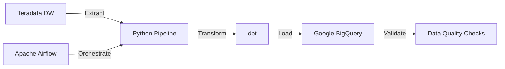

# Cloud Migration Toolkit

## Overview
Automated migration framework for moving data warehouses from Teradata to Google BigQuery, 
including schema conversion, data validation, and performance optimization.

## Architecture
- **Source:** Teradata Data Warehouse
- **Target:** Google BigQuery
- **ETL:** Python-based migration pipelines
- **Transformation:** dbt (data build tool)
- **Validation:** Automated data quality checks

## Technologies Used
- Python, SQL
- Google BigQuery
- Teradata
- dbt (data build tool)
- Apache Airflow

## Key Features
✅ Automated schema conversions from Teradata to BigQuery  
✅ Incremental data migration with CDC  
✅ Data validation and reconciliation  
✅ Query performance optimization  
✅ Rollback capabilities  

## Migration Process
1. **Schema Analysis** - Extract and convert Teradata schemas
2. **Data Extraction** - Export data in optimized batches
3. **Transformation** - Convert SQL dialects and optimize
4. **Loading** - Load to BigQuery with partitioning
5. **Validation** - Reconcile row counts and sample data

## Project Status
🚧 This project demonstrates real-world migration patterns 
applied during Teradata to BigQuery migrations at enterprise scale.

---
*Part of [Sushnith Vaidya's Data Engineering Portfolio](https://github.com/sushnith2022-art/portfolio)*
