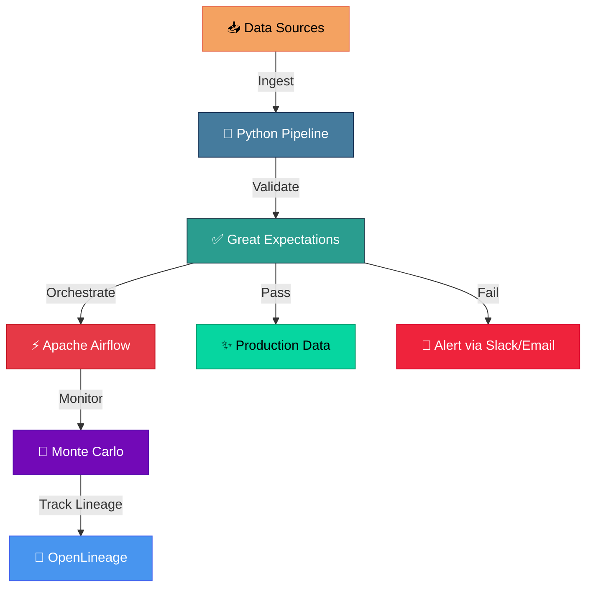

# Data Quality Framework

## Overview
An automated data validation and quality monitoring system using Great Expectations,
Apache Airflow, and Monte Carlo for end-to-end data observability.

## Architecture

## Architecture Details
- **Validation:** Great Expectations for data quality checks
- **Orchestration:** Apache Airflow for scheduling
- **Monitoring:** Monte Carlo for data observability
- **Lineage:** OpenLineage for data lineage tracking
- **Alerting:** Email/Slack notifications for anomalies

## Technologies Used
- Python
- Great Expectations
- Apache Airflow
- Monte Carlo
- OpenLineage
- PostgreSQL (metadata store)

## Key Features
✅ Automated data validation suites  
✅ Schema, completeness, and anomaly checks  
✅ Data lineage tracking and visualization  
✅ SLA monitoring and alerting  
✅ HIPAA compliance validation  
✅ Integration with CI/CD pipelines  

## Validation Types

| Check Type | Description |
|---|---|
| Schema | Column names, data types, nullability |
| Completeness | Null values, empty strings |
| Uniqueness | Primary key validation |
| Range | Min/max values, distributions |
| Referential | Foreign key relationships |
| Custom | Business rule validation |

## Project Status
✅ This project demonstrates real-world data governance patterns
applied to healthcare datasets with HIPAA compliance requirements at CVS Health.

---
*Part of [Sushnith Vaidya's Data Engineering Portfolio](https://github.com/sushnith2022-art/portfolio)*
