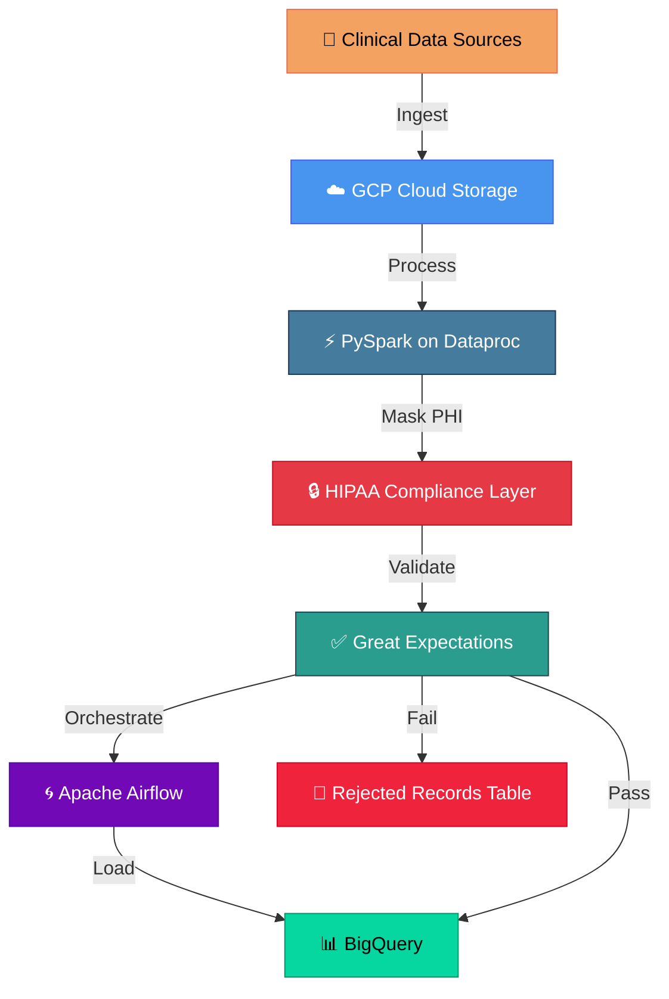

# Healthcare ETL Pipeline

## Overview
A scalable ETL pipeline for processing healthcare data with HIPAA compliance, 
built using PySpark, Apache Airflow, and Google Cloud Platform.

## Architecture

## Architecture Details
- **Processing:** PySpark on GCP Dataproc
- **Orchestration:** Apache Airflow
- **Storage:** BigQuery for data warehouse
- **Compliance:** SHA-256 data masking for HIPAA
- **Quality:** Great Expectations validation

## Technologies Used
- Python, PySpark
- Apache Airflow
- Google Cloud Platform (BigQuery, Dataproc, Cloud Storage)
- Great Expectations (data quality)

## Key Features
✅ HIPAA-compliant PHI masking with SHA-256 encryption  
✅ Schema validation with PySpark StructType  
✅ Automated data quality checks  
✅ Valid/Invalid record separation  
✅ Partitioned output to BigQuery  
✅ Orchestrated workflows with Airflow  

## Project Status
✅ This project demonstrates real-world healthcare ETL patterns
with HIPAA compliance applied at CVS Health.

---
*Part of [Sushnith Vaidya's Data Engineering Portfolio](https://github.com/sushnith2022-art/portfolio)*
