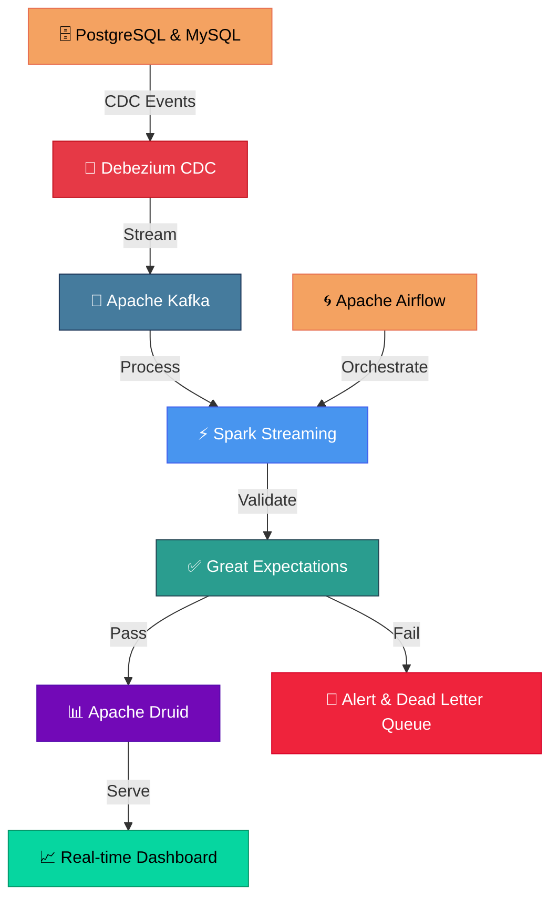

# Real-time Data Streaming Pipeline

## Overview
A real-time data ingestion and processing pipeline using Apache Kafka and Spark Streaming, 
with Change Data Capture (CDC) for near real-time analytics.

## Architecture


## Architecture Details
- **Data Source:** Operational databases (PostgreSQL, MySQL)
- **CDC:** Debezium for change data capture
- **Streaming:** Apache Kafka as message broker
- **Processing:** Spark Streaming for real-time transformations
- **Validation:** Great Expectations for data quality
- **Storage:** Apache Druid for real-time analytics
- **Orchestration:** Apache Airflow

## Technologies Used
- Apache Kafka
- Spark Streaming
- Python, PySpark
- Debezium (CDC)
- PostgreSQL, MySQL
- Apache Druid
- Great Expectations
- Apache Airflow

## Key Features
✅ Real-time data ingestion with sub-second latency  
✅ Change Data Capture (CDC) from multiple sources  
✅ Scalable stream processing with Spark  
✅ Fault-tolerant with exactly-once semantics  
✅ Great Expectations data validation  
✅ Real-time analytics with Apache Druid  

## Pipeline Flow
```
Database → Debezium CDC → Kafka → Spark Streaming → Great Expectations → Druid → Dashboard
```

## Project Status
✅ This project demonstrates real-world streaming architecture
with CDC implementation applied at CVS Health.

---
*Part of [Sushnith Vaidya's Data Engineering Portfolio](https://github.com/sushnith2022-art/portfolio)*
